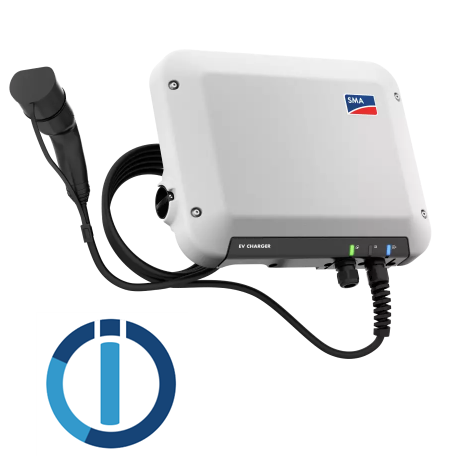

# ioBroker.smaevcharger

**Tests:** 

## smaevcharger adapter for ioBroker

Controller for the SMA EV Charger 7.4 / 22

### Installation

At this stage, you can install ioBroker using the expert mode. When in expert mode, go to adapters and pick "install from URL" in the menu. In the third tab, you can paste the URL of this repo:

`https://github.com/drb-germany/ioBroker.smaevcharger`

### Configuration

Configuration requires the IP and username/password of the SMA EV charger in your network. Please note that the user needs administrator rights on the charger to change values. The adapter will read values from and write values to the charger in regular intervals (see configuration).

The parameters allowCharging, lockStation and maximumCurrent can be changed in the adapter. Any changes will be written to the charger in the write cycle. Until then, no changes will take place! This is done to protect the charger from too many changes. If the adapter receives too many changes, they will be ignored, details on this are not given by SMA. However, please not that it is well known that currents and on/off values should not be changed too frequently during the charging of the vehicle.

By setting the value `forceChanges` to true, any pending changes will be written immediately. Use with care.

At this stage this module is tested with the charger in "fast charge" mode. Putting it in optimized charging mode will likely ignore the values. More information will be given after testing.

## Changelog

<!--
	Placeholder for the next version (at the beginning of the line):
	### **WORK IN PROGRESS**
-->

### **WORK IN PROGRESS**

-   (Martin) initial release

## License

MIT License

Copyright (c) 2023 Martin

Permission is hereby granted, free of charge, to any person obtaining a copy
of this software and associated documentation files (the "Software"), to deal
in the Software without restriction, including without limitation the rights
to use, copy, modify, merge, publish, distribute, sublicense, and/or sell
copies of the Software, and to permit persons to whom the Software is
furnished to do so, subject to the following conditions:

The above copyright notice and this permission notice shall be included in all
copies or substantial portions of the Software.

THE SOFTWARE IS PROVIDED "AS IS", WITHOUT WARRANTY OF ANY KIND, EXPRESS OR
IMPLIED, INCLUDING BUT NOT LIMITED TO THE WARRANTIES OF MERCHANTABILITY,
FITNESS FOR A PARTICULAR PURPOSE AND NONINFRINGEMENT. IN NO EVENT SHALL THE
AUTHORS OR COPYRIGHT HOLDERS BE LIABLE FOR ANY CLAIM, DAMAGES OR OTHER
LIABILITY, WHETHER IN AN ACTION OF CONTRACT, TORT OR OTHERWISE, ARISING FROM,
OUT OF OR IN CONNECTION WITH THE SOFTWARE OR THE USE OR OTHER DEALINGS IN THE
SOFTWARE.
